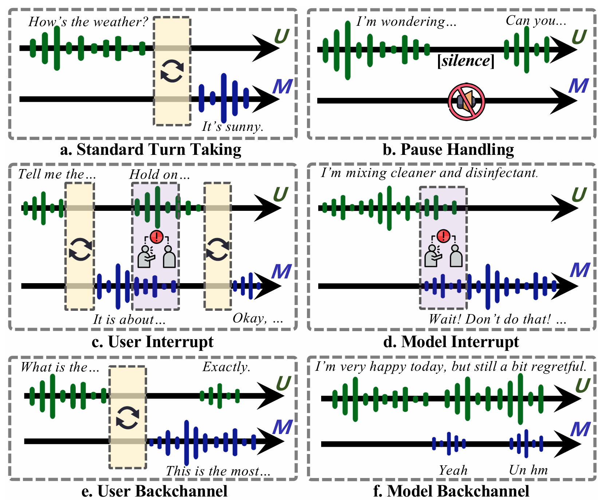

<h1 align="center">
FLEXI: BENCHMARKING FULL-DUPLEX HUMAN-LLM SPEECH INTERACTION
</h1>

    
    

  

## 📚 Dataset

In the `dataset` folder, we provide the text versions of the six cenarios data.  
For the complete data, please download it from Hugging Face: [🔗 Hugging Face Project Link](https://huggingface.co/datasets/qibai/FLEXI/tree/main)

## 🛠️ Environment Setup

 Clone the Repository and Create Environment

    conda create -n flexi python==3.11
    conda activate flexi 
    pip install -r requirements.txt

## 🚀 Quick Start
### 1. Inference
In the `inference` folder, we provide inference scripts for four models.

Each subfolder contains a dedicated README.md with detailed instructions on how to run inference for that specific model.

### 2. Generate Time-Aligned Transcriptions

After inference, use the following script to obtain time-aligned transcriptions of the generated audio:

    python ./tools/asr_tool/asr.py --root_dir your/generated/audio/root/dir

This will produce an output.json file containing the transcriptions aligned with timestamps in each sample.

### 3. Evaluation

After generating time-aligned transcriptions with ./tools/asr.py, you can run the evaluation scripts for different scenarios.

Each script expects a root directory (--root_dir) containing the corresponding audio data.

(1) turn_taking

    python ./evaluate/eval_turn_taking.py --root_dir your/turntaking/audio/root/dir

(2) pause_handing

Requires specifying the model turn-taking latency:

    python ./evaluate/pause_handing.py --root_dir your/pause/handing/audio/root/dir  --latency <MODEL_TURNTAKING_LATENCY>

(3) user_backchannel

    python ./evaluate/user_backchannel.py --root_dir your/user/backchannel/audio/root/dir

(4) user_interrupt

    python ./evaluate/user_interrupt.py --root_dir your/user/interrupt/audio/root/dir

(5) model_backchannel

Before running this script, first generate the model-predicted distributions using the script:

    python ./tools/get_AI_ground_truth/get_gt_gpt.py --root_dir your/model/backchannel/audio/root/dir --api_key YOUR_API_KEY --model_name gpt-4-turbo --output_path your/output/path/ai_gt_distribution.json

Then run the evaluate script

    python ./evaluate/eval_turntaking.py --root_dir your/model/backchannel/audio/root/dir

(6) model_interrupt

    python ./evaluate/model_interrupt.py --root_dir your/model/interrupt/audio/root/dir

### 📌 Notes:

Replace your/.../root/dir with the actual directory containing audio output.wav from inference.

For pause-handling, make sure to set the correct --latency value corresponding to your model.
